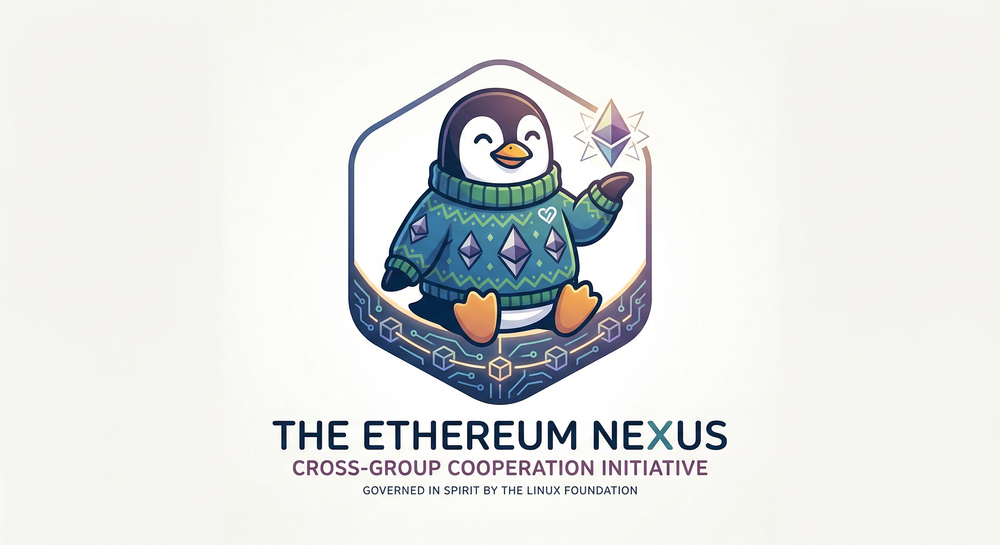

# Ethereum Cross-Group Effort

**Date:** March 19, 2026

**Status:** Draft / Conceptual

**Target Stakeholder:** Hart Montgomery (CTO, Linux Foundation)

---

## 1. Initial Brainstorming: Naming
**User Prompt:** *give me a name for a cross-group effort around ethereum*

**Suggested Names:**

* **Ethos Bridge:** Connection between different philosophies.
* **Consensus Core:** Central hub for decision-making.
* **Syzygy:** (The "Nerd-Flex" Choice) The rare alignment of celestial bodies.
* **The Gwei Forward:** A pun on "the way forward."

---

## 2. The "Hart Montgomery" Adaptation
**User Prompt:** *make this funny to Hart Montgomery, the CTO of Linux Foundation*

**Refined Ideas for LF Context:**

* **The Consensus Protocol for People:** Because BFT is easier than scheduling a meeting.
* **The Merkle Tree Huggers:** Open-source peace through cryptography.
* **Hyperledger: ETH Edition:** (High-risk/High-reward humor).
* **Project Herd Immunity:** Because managing Ethereum coordination is like vaccinating cats.

---

## 3. The Official Governance Charter
**User Prompt:** *yes (to drafting an "Open Source Governance Charter")*

### **Charter of the Ethereum Nexus Working Group**
#### **Version 0.1-RC1 (The "Wait, who is the Maintainer?" Edition)**

**1. Mission and Scope**
The mission is to provide a neutral environment for Ethereum-adjacent groups to disagree in a standardized format. 

**2. Technical Steering Committee (TSC)**

* **Composition:** One representative per group + one sacrificial lamb for YAML files.
* **Voting:** **Proof-of-Boredom** consensus. If a meeting lasts 45 minutes without a logout, it's ratified.

**3. Governance Model**

**Benevolent Dictator for a Fortnight (BDF-F):** Rotating the lead maintainer every two weeks so no one is held legally or emotionally responsible for the codebase.

**4. Intellectual Property Policy**

* Apache 2.0 license.
* Penalty: Mentioning "The Merge" nostalgically more than 3x requires a donation to the *Hart Montgomery Coffee & Cryptography Fund*.

**5. Definitions**

* **Decentralization:** Having more than one Slack workspace.
* **Interoperability:** Sending a JSON object and praying.

---

## 4. Visual Identity
**User Prompt:** *logo*

*Caption: Tux the Penguin wearing a Vitalik-style knit sweater, holding a stylized Ethereum crystal.*

---
